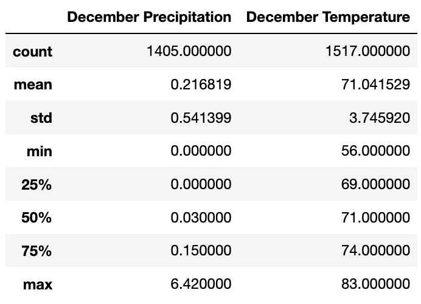

# surfs_up

## Purpose

The purpose of this challenge is to help our client W.Avy determine if the weather in Oahu is suitable enough to open and sustain a joint surf/ice cream shop. This will be done by looking at temperature trends in June and December.

## Results

Three key points about the temperatures in these two months are as follows.

•	December has a more volatile temperature range  (27 degrees) with a minimum of 56 and a maximum of 83. Compare this to June with a range of 21 degrees and a minimum of 64 and a maximum of 85. The standard deviation follows suit with a 3.26 std for June and 3.75 for December
•	The mean temperature in June is higher (74.9) than it is in December (71)
•	The biggest takeaway from looking at these temperatures is that temperature variability is relatively even throughout the year.

## Summary

As stated, temperature variability is relatively even during our two months analyzed. See below.

Furthermore, we tested precipitation during these two months as well. Our results show that overall, June is a drier and warmer month than December, although much like with temperature, the variability is slim.

Overall, it is my analysis that the relative lack of volatility with temperature and precipitation in Oahu from June until December make this idea viable as it comes to useage throughout the year.
